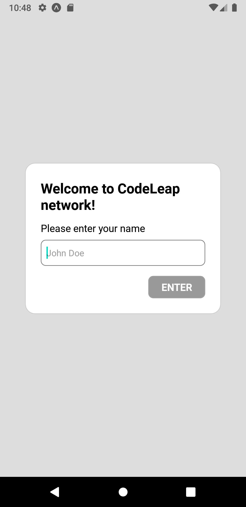
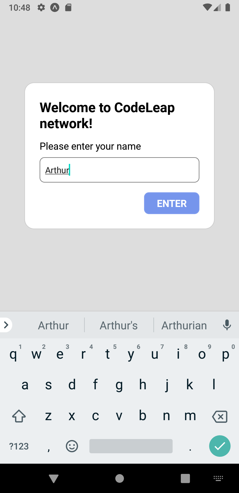
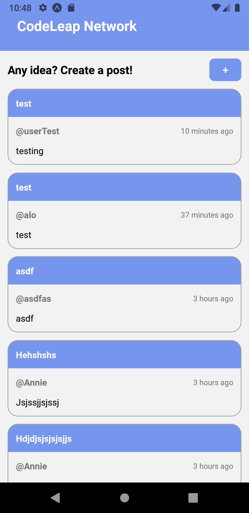
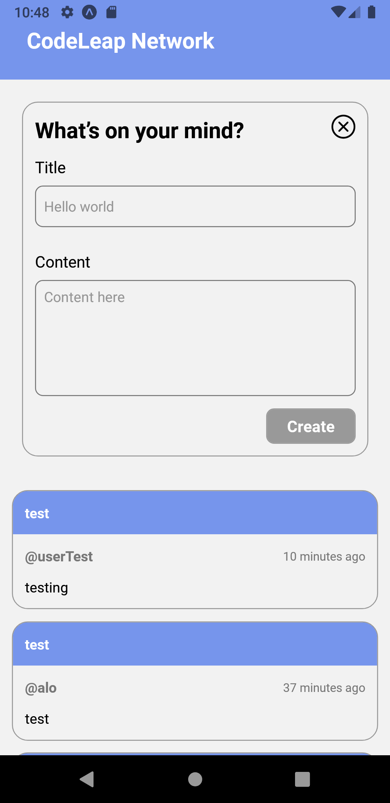
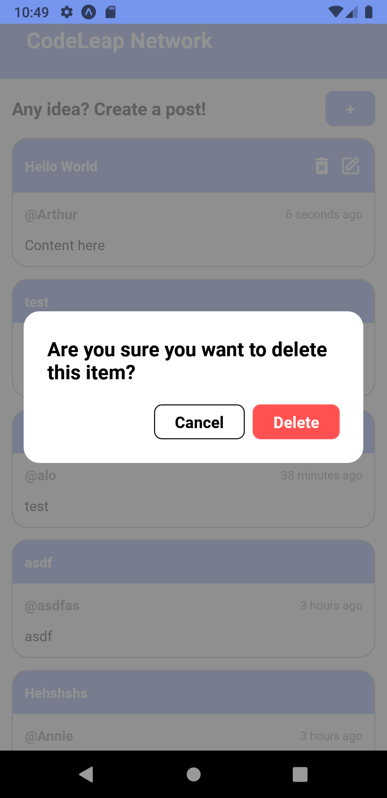
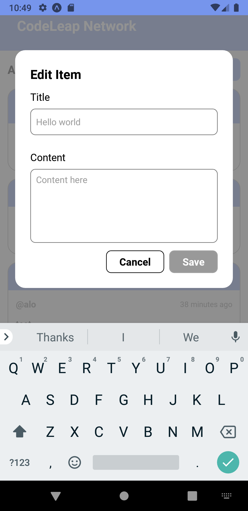

# 🚀 CodeLeap - (CodeTest)

CodeLeap - (CodeTest) is a mobile app developed using Expo. This app was created as part of a code test for [CodeLeap](https://codeleap.co.uk).

The project is Live on Expo: [App](https://expo.dev/@xarthurlm/CodeLeap-Test?serviceType=classic&distribution=expo-go)

## 🚀 Features

- CRUD operations.
- Pretty animations.
- State Management.
- Pagination.

## 🛡️ Technologies Used

- React Native
- Expo
- Expo Router
- Redux toolkit
- Styled Components
- Reanimated

## 📱 Screenshots

<div style="display:flex;gap:5px;flex-wrap:wrap">
  
  
  
  
  
  
</div>

## 🌟 Getting Started

To get started with this project, you will need to have Expo installed on your local machine. You can download Expo from the official website or install it using npm:

```
 npm install -g expo-cli
```

Once you have Expo installed, you can clone this repository and install the dependencies using npm:

```
git clone https://github.com/ArthurLopesMagalhaes/CodeLeap.git
```

```
cd CodeLeap
```

To install the dependencies, run:

```
yarn
```

To start the development server, run:

```
npx expo start
```

This will start the Expo development server and open the Expo DevTools in your terminal. From here, you can run your app on an emulator, connect to a physical device, or run the app in a web browser.
